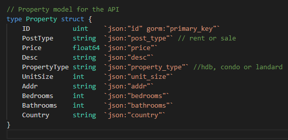

# GO REST API

This project is about a simple GOLANG REST API service with sqlite as database. The project has dockerized, versioning and throttling.

## How to build and run docker image

- use command `docker build -t api .` to build the docker image with a name as api.
- use command `docker run -it -p 8080:8080 api` to run the docker image, then can use the tools like Postman to test the APIs.

## How to run without the docker

- In the terminal, enter `go run main.go` to run the application, then can use the tools like Postman to test the APIs.

## APIs

### **GET**

1. Get all properties

- `http://localhost:8080/api/v1/properties`
- Return all exisiting property in the database.
- If the database is empty, it will return an empty json object.

2. Get all countries

- `http://localhost:8080/api/v1/countries`
- Return all avaialble country in the database.
- If the database is empty, it will return an empty json object.

3. Get single property by id

- `http://localhost:8080/api/v1/properties/{id}`
- Return the details of specific property of given id.
- If this property does not exist, it will return error message.

4. Get single country by id

- `http://localhost:8080/api/v1/countries/{id}`
- Return the details of specific country of given id.
- If this country does not exist, it will return error message.

### **POST**

1. Create new property listing

- `http://localhost:8080/api/v1/property`
- By providing the correct required field in the body of request, it will create new property in database and return the detail of newly created property.
- If the required field is not fulfiled or incorrect data given (such as not avaialble country), it will return the error message.
  

2. Create new country (for adding new country in the database)

- `http://localhost:8080/api/v1/property`
- By providing the correct required field in the body of request, it will create new property in database and return the detail of newly created property.
- If the required field is not fulfiled or incorrect data given (such as not avaialble country), it will return the error message.
  

### **PUT**

1. Update the existing property

- `http://localhost:8080/api/v1/properties/{id}`
- Update the exisiting property by the given id with the provided information in the body.
- If the required field is not fulfiled or incorrect data given (such as not avaialble country), it will return the error message.

### **DELETE**

1. Delete the exisiting property

- `http://localhost:8080/api/v1/properties/{id}`
- Delete the exisiting property in the database by the given id.
- If this property does not exist, it will return error message.

## Models

### **Property**

- The required fields in the property are PostType, PropertyType, Addr, Bedrooms, Bathrooms and UnitSize.
- The country must be exisiting country in the database.
  

### **Country**

- The country only has single field which is country field.
- The country required to add before adding any property.
  

## Versioning

- The API has been implemented with the versioning. Current version is v1. The application can add new version when needed by just adding a new version group.
  

## Throttling

- The API has been implemented with the throttling. The maximum burst request per client IP is 10qps and will take an hour to reset the limiter.
- The client will received abort status if in limited stage.
  

## Future Improvements
- The application can be adding authentication for certain API operations such as add new country.
- Introduce the caching to further improve the performance of the quering.
- Able to support the custom search by filter with field data instead of just by the ID.
- More data verification such as check the max or min of the room, the validity of the address and etc.